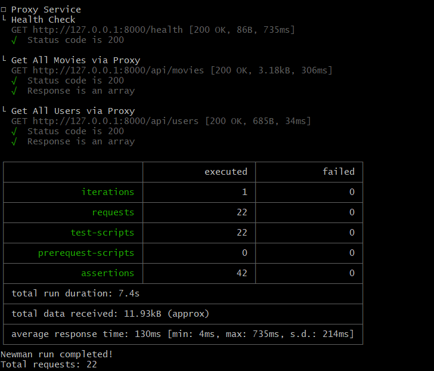
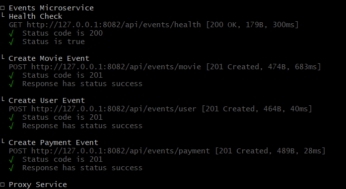
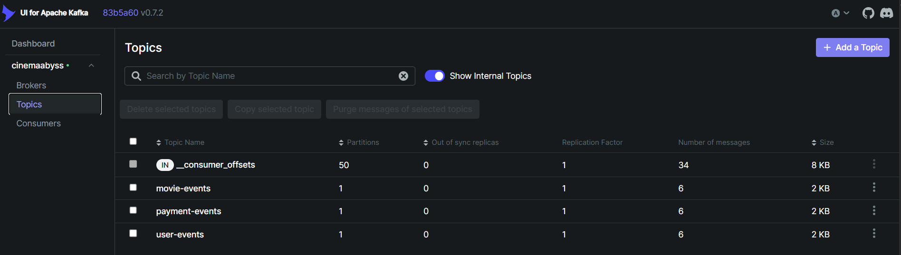
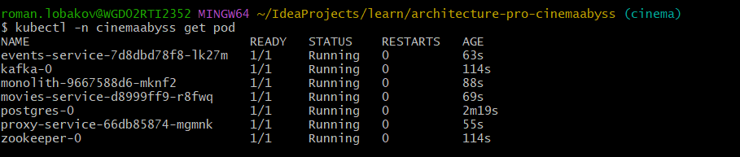
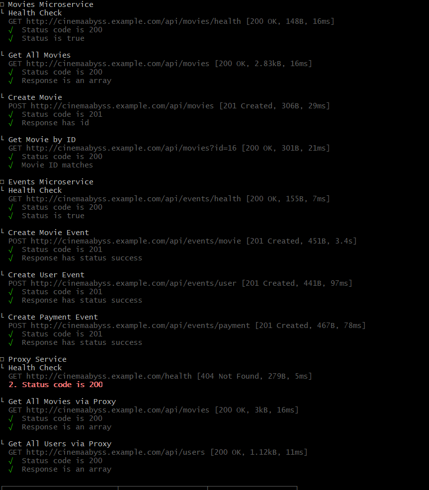
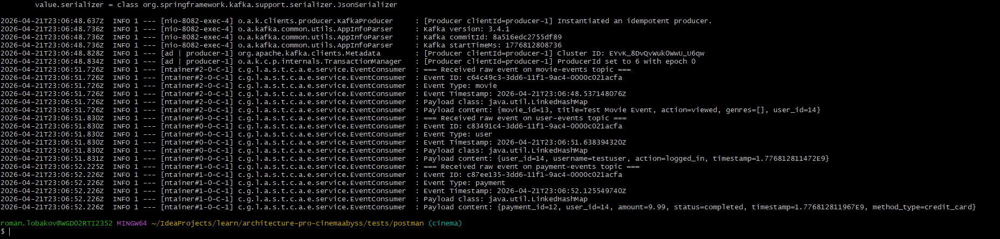
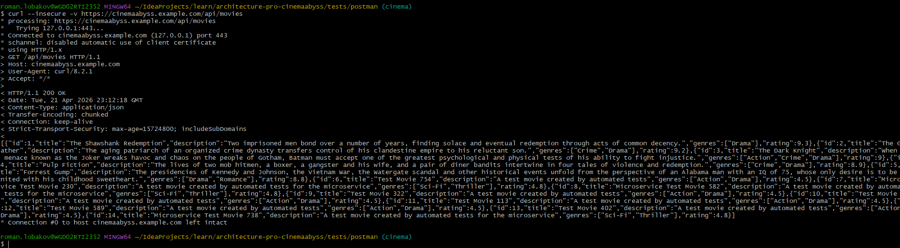
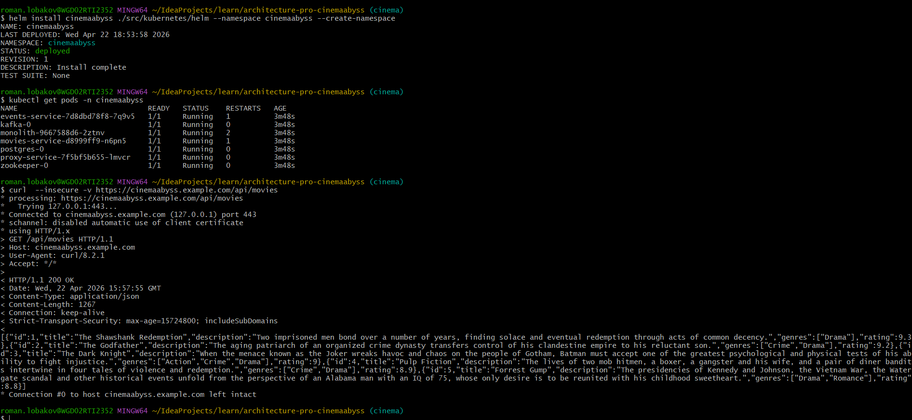
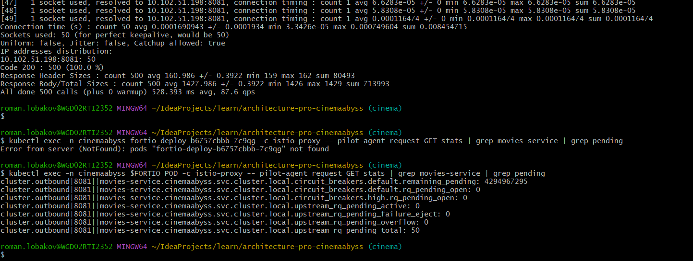

## Изучите [README.md](README.md) файл и структуру проекта.

## Задание 1

1. Архитектура toBe

![Диаграмма контейнеров ToBe системы](https://img.plantuml.biz/plantuml/png/nLfRJnjN47v7uZziUIAIexHA7gigr6cJjY9oCAdw5YrcawoARUHTqgAg4fTSGAIGqagDgWgQHdqtnWu6RESlxFwZpimvktkkcuLScYWuUpbplfavC_FDcAj1wBR2fVh2-DX7VgEsi3JlEP-MhrmgNxbJRZP2rszuhS_6nyR7GZzSy9moNDVTgRdb872YtwD-r8uEunNuEO2_RIVwCnf5mtWjwaN7qJ3gmQDHrC7b5QyLD1kJvQKWRDQzLicPYFRXsMdyD3h2Tw8shOBh2Ne6A_jm_m0-U_2aZJ-Tw3NSwiBFVhmQdKJzaWEVWsWKh-7h-487LdL1piY1xTkq85wXzQTHh-J0rMDuEeItEbnc_10k4COWte8NkhWfFEh0lHtj1TZ0WQiZmjK6EKDulJTn0JLCpNNdy-PIOzvjBK_MFaPTNiQh170K7UF_S6UcYQxypiG5vwVnCGV-fE8cfvjp_eA7aluYS0pDCDwAUWvR1pWVak41O1zbdoAuU0FnnrjeqE_Skjlo6nEQ5CGFAyZSft3nYfk7b99nLCgu6ZqyW0LFustSF5vnQ6KV3JwAr-7UGRmUdU1ENxiFt6gjvI-69MTsUT5B_Z_ZkRMGeEp2RWSNmObjiCsQlkNij_ZM2pnRwCQBqJ_HRheVdH6oABhh96ghYkxhMg63mSnEhg0-0ldPvjDFGBGG1YQFJItwrztG-y5TXdUdAbyv_0fHNM_gQfRTsdrqC7tYIpFUl1-mOwL8NWhlLxtM0x_cCSjWY7KGlOFWGOKHANq41diCdttBISC0vMXGpZDnARWl3JRpGbM1QtC4xDeSoleLW1pX4U-o28ctuaSOfobIV6R4Yb0gpI2yr_82WlKlZp8ARTEI4Msm7c-ZBuSO1F1um1x6soO3LjpbkjS8RJOSySW-mAI2Hu574od_Ih4Q9h0ZM3bASuKbhBTHC9FpXAKUYCkdMZepsLN6csDX4qwxCGtM8kKpe10CyIEJ1My7NijclY9dhG0EQtf4FS4bVVo4_9ubLWn_1bSre00tttevoCzgnnpy9ejMb-O2Ier-in6KtT1TQDvZgRRDIzSeEfHFouXbs7CSnDTgPJKUHLO-kNtxe1me6XsYB5PsX7260cCmkqcdFFjBkYO5Kj7sV6x8j6hZHb3WIQrrkCttvYL1jGoLZ7YdXAddX8JoyyTC1CjER34otNpWUtPNPfG2BQeuah2oEevdEsCuoZ8Y8XONgHaNTp4uIO9v5k_e2jXzC-04BXKe4J4wQts7LL_un-fm7mo-hkvYYfpG3VqWz6l1L6D-gk4kB0T-e6ObNJRRa_2WJbHF12_ifKK0WsCheueca6HV9TgIWuEMJtb5oYVXT044P55eW6vQ_KnHPDAlU9ajhhdLVIQTIrOTIexevZIovErqFwAcbwMTyULuap9DklyJq8qYZyLigZLYhbxM3zu98uqK5zGi4B4VihuaeSeKOa-86i9n0nfAPvndESm3gq0lLenPRl8Rz-xthdxQO3qcaKtEEO-nAq6IiaPM6xAR29VMinC7ZmwvvYd_GfPEzjLamaaQ9753zxV8GFpkW2X05y_cW1p6ieXmCF2-hiwCEpVdXzEt2ce4RsnakYIBtq8T912YN7RFX5j5VhCP-dVzcal51W18ryxKuk82lyY2lEervWEd8RwOilxgSX1wzJjV_1XELkj1nkIhqrKd-Wr90NLnd1p838YV-AuG-1Xqi1J52v8hIy5z2QV0gVOP0yjAclDbUJffLwOgDmjlMxbTlU600n1ibyBrDF6X0cV6gpNhm3Jd2GnxWBlyhGKwRzE9V-sWWrXcw25E3anFUhmI7v12Y4pB84dYv1KdRUGLdDMmvRbrlt6FcojW2Nj8BUyn72ugpKEYxpqouWhhWAdBwqaMGaAspJ95ChKOugN01uJoopANw45EpUbE8FYDuc-O4ANKF0AEFZ_WRRQ_IDtxM1lVr7sDZyru2y8m9HiHF1Uh4GizElGpbJ8kb9UnzlfCIzWGmBBanknifPhX4zjWfN4rD9nWfXrrNr52qYGhIJx-9TvmiAwa_cBSYAMELNG09gpypiIofTBglAGjf6ETLJkUaFMsX99MpYOszhyBGWz0oHNBy2jFfjxbxidzvvabQenMWLSIuwNDEMadVQRFtUIWAoKUMWU4xNoUb8ioYGDZj7CMboNEF5aiEDvU3ekOudAK859TcPAEPt3sr_WqWPgJItnc0MqUSgLau9LD7dfyO7bid3pWPegNCuAZyKZUeV76ggHdImWpmU_GmSd3LO5AM2QgYCSS6_cmJgYrOni8pRtOInQJ_bneAljC8yvfUdnMyiQ-a7OnzoZfDdg5pHlS8LVA3eVYBsDn_2DBZKhGyQP7EBS60LhWlv0RJh5KgzACzjLpqpuTd5CqQuUo2jfS7m7WZHxdq6qz5LlC9KqoMDbuZDGudNEnifn6dIdcJ9N-F4WOiM0bYfgGZOG0onoWRKMK830Q4JZ_6XEC_3zBygbWGtenypwv5JX33ulpxkbRbJUSVL7y7eZMB8XfeWVsEsLjNphbDNVWkRLTX9FjQnqSMABHBib6dFTq5JXXrfEMA9qN494kPRFrTp0GpplVufYqu7nDEBHPofDuapQ0VRi1Qia-_dMIhDcLgg2X2CW9sfYcx0FCGlWDOqODG979OWx0ongOzp3nC5GPmzJm7GtyxBCq2vGFPmDBmiWPq7s8AHeYuqH2wLNU1plaEscCu7mCHf1e7-F-JxppNBYA4qykNXrRGOEf3Meosc3_bO5q7i0wPEdRPwglAHUGZXL-VS3wPvq89esKBAl0f02xfZClmXQfq2A94yarKbg-oxuGGzV6cqa_kOOke06avUjdSuwH9HTZlqoGubzfbcZcFQyvCzmKUU4ecHuQPEg-Dd0fWzGE9KhwDP1X0VfCvpBxHOqiK1GuUKDD4pYQJveGPaOKhIQtz_JT8ytzoBs6AQV1VdQ4USAjSzIiCja5PuE4CmaT7xiAh99-C-i_)
[Также диаграмма контейнеров в формате .puml](schemas/СinemaAbyssContainerC4.puml)

## Задание 2

### 1. Proxy

Реализовал прокси-сервис:

### 2. Kafka

Скриншот тестов:

Скриншот состояния топиков:

## Задание 3

Реализовал CI/CD (см .github/workflows)

#### Шаг 2

Вывод списка подов:

Вывод тестов:
  

#### Шаг 3

Вывод events:

Вывод https://cinemaabyss.example.com/api/movies

## Задание 4

Скриншот развертывание хелм чартов и вызова https://cinemaabyss.example.com/api/movies

# Задание 5

Скриншот статистики circuit breaker (конфиг для circuit breaker делал сам, вы его почему-то постеснялись в репозиторий положить):

